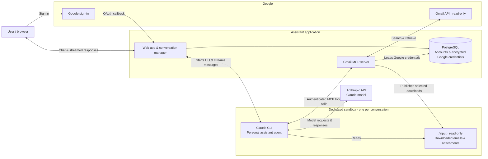

# Personal Assistant Agent

A personal assistant agent that currently integrates with Gmail. Connect your Google
account and chat with the assistant to find emails, read conversations, and retrieve
attachments. Gmail access is read-only.

The web app runs Claude Code in a dedicated sandbox for each conversation. The agent
uses Gmail MCP tools to access your mailbox and can download selected messages and
attachments for local analysis. Conversations last until reset, idle expiry, or an
app restart; chat history is not persisted.

## Architecture



## Run locally

You need Docker with Compose, Python 3, and [uv](https://docs.astral.sh/uv/).

1. Create a Google OAuth **Web application** client, enable the Gmail and Google
   Calendar APIs, and register `http://localhost:8000/auth/google/callback` as a
   redirect URI. The current Google connection requests read-only access to both
   services; the chat assistant currently integrates with Gmail.
2. Copy `.env.example` to `.env`. Set the Google client credentials,
   `ANTHROPIC_API_KEY`, and `POSTGRES_PASSWORD`.
3. Generate `CREDENTIAL_ENCRYPTION_KEY` with:

   ```bash
   uv sync
   uv run python -c 'from cryptography.fernet import Fernet; print(Fernet.generate_key().decode())'
   ```

   Put the generated key in `.env`, and save the same database password as
   `POSTGRES_PASSWORD` in `deploy/local-db-password.txt` (ignored by Git).
4. Start Docker and run:

   ```bash
   ./deploy/local.sh
   ```

Open http://localhost:8000, sign in with Google, and ask the assistant a question.
Run the script again after source changes to rebuild. For direct Compose commands,
first run `export SANDBOX_HOST_INPUT_ROOT="$PWD/data/session-inputs"` from the repo
root. Use `docker compose logs -f app` for logs and `docker compose down` to stop.

The local script logs completed Claude messages by default, including email content
and tool results. Disable this with `CLAUDE_DEBUG_STREAM=false ./deploy/local.sh`.

## Development

Run checks with `uv run pytest -q` and `uv run ruff check .`.
See [AGENTS.md](AGENTS.md) for contribution guidelines and
[.env.example](.env.example) for configuration. Agent instructions live in
[`src/assistant_agent/agent_kit/`](src/assistant_agent/agent_kit/).

## Deployment

AWS infrastructure lives in [`terraform/`](terraform/), with deployment scripts in
[`deploy/`](deploy/). After provisioning infrastructure and configuring secrets,
run `./deploy/deploy.sh`. Use one app worker/replica per deployment and one deployment
per application database.
